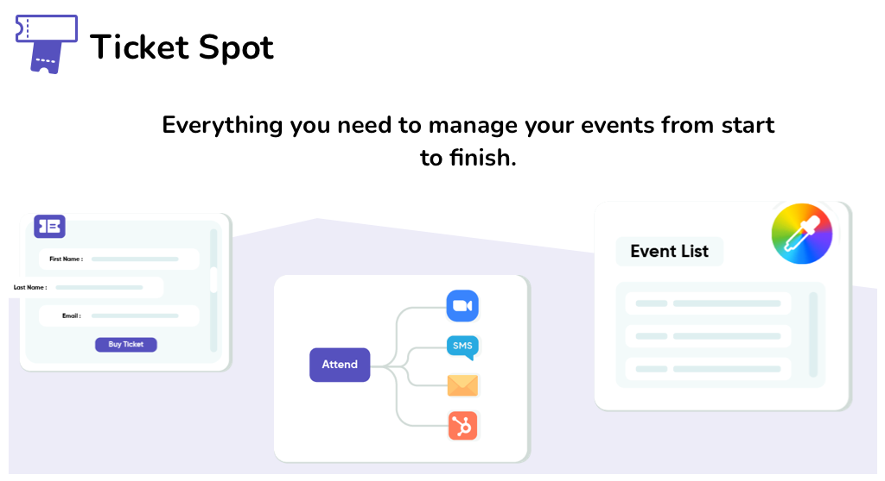

<!-- PROJECT LOGO -->
<br />
<p align="center">


  <h1 align="center">Ticket Spot</h1>

  <p align="center">
    For WordPress
    <br />
    <br />
    <a href="https://github.com/Ticket-Spot/wordpress-app/issues">Report Bug</a>
    ·
    <a href="https://github.com/Ticket-Spot/wordpress-app/issues">Request Feature</a>
  </p>
</p>
<!-- TABLE OF CONTENTS -->

<p align="center">

  
  </p>

## Table of Contents

- [Table of Contents](#table-of-contents)
- [About The Project](#about-the-project)
- [Getting Started](#getting-started)
  - [Prerequisites](#prerequisites)
  - [WordPress Setup Guide](#wordpress-setup-guide)
  - [Building From Source](#building-from-source)
- [License](#license)
- [Contact](#contact)


## About The Project

* Sell Tickets, Collect RSVPs and Promote Events
* Save time by automatically sending emails when attendees perform specific actions.
* Design & Customization your event list fonts, colors, and layout to match the theme of your website.


<!-- GETTING STARTED -->

## Getting Started

### Prerequisites

As this is a wordpress plugin this project requires wordpress to run.

(OPTIONAL) If you wish to modify the Javascript source files and/or PHP dependancies within this project, then you would also need to nave Node, NPM, and Composer installed.

### WordPress Setup Guide

1. Create a [Ticket Spot](https://app.ticketspot.io) - Takes 30 seconds to create one!
2. Create a wordpress site.
3. Use the generated shortcode into your block or within the editor

### Building From Source

1. Go to your wordpress plugin folder

```sh
cd htdocs/wp-contents/plugins
```

2. Download or clone this repo

```sh
git clone https://github.com/Ticket-Spot/wordpress-app
```

3. Open up wordpress and configure the plugin (refer to above)
4. (Optional) Editing javascript. Edit stuff in srcjs and don't edit javascript in includes (its minified and generated from files in srcjs anyway). You'll need nodejs to run though.
5. (Optional) Build your own javascript files

```sh
npm i
npm run develop
```

<!-- Issues -->

## Issues

See the [open issues]( https://github.com/Ticket-Spot/wordpress-app/issues) for a list of proposed features (and known issues).

<!-- LICENSE -->

## License

Distributed under the GPLv3 License. See `LICENSE` for more information.

<!-- CONTACT -->

## Contact

Ticket Spot Support - chris@ticketspot.io or use our live chat after creating a Ticket Spot account

Project Link: [https://github.com/Ticket-Spot/wordpress-app]( https://github.com/Ticket-Spot/wordpress-app)
